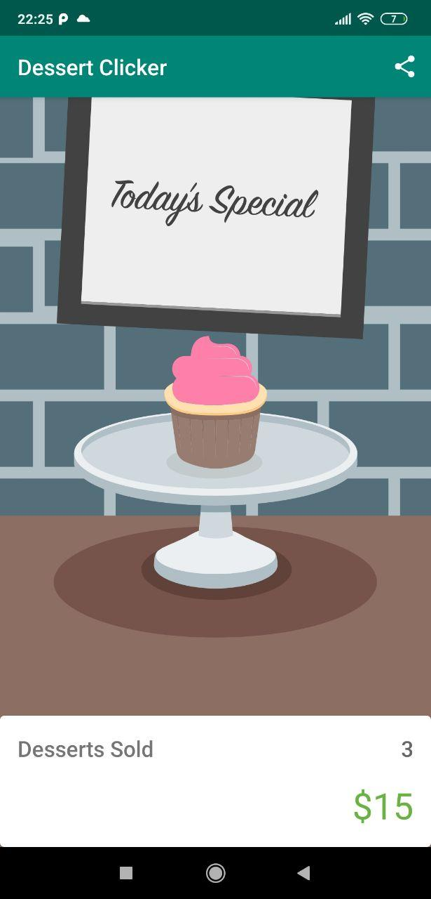

DessertClicker - Starter Code
==============================

Starter code for Android Kotlin Fundamentals Codelab 4.1 Lifecycles and logging.

Introduction
------------

DessertClicker is a game about making desserts. Press the button, make a dessert,
earn the big bucks.

You use this app in the course to explore the Android lifecycle and log messages to
the Android console (Logcat).

